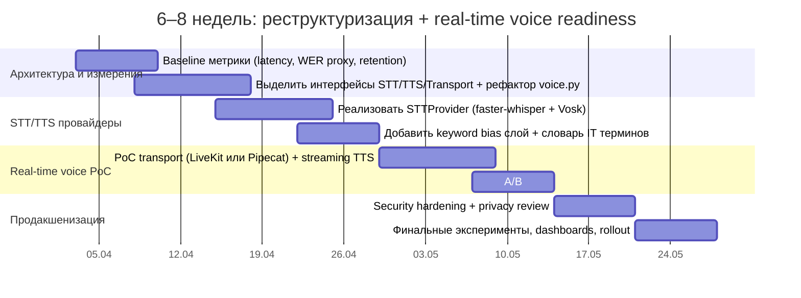
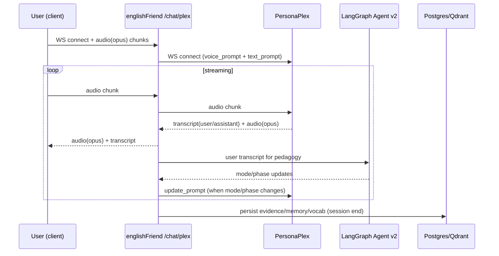
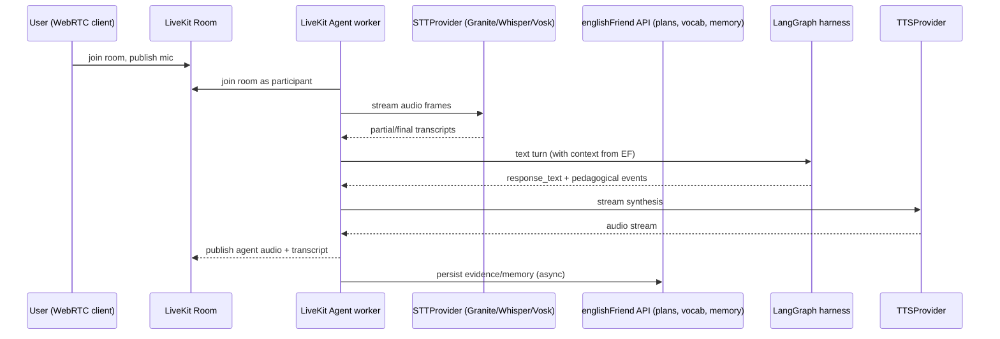

# Реструктуризация englishFriend под современную архитектуру с измеримым улучшением продукта и будущим real‑time voice

## Executive summary

Ваш текущий `englishFriend` уже содержит сильные заделы для «производственного» AI‑продукта: **LangGraph‑агент v2 с JSON‑выходом**, A/B‑шаблоны промптов из БД, **Langfuse‑трейсинг**, Prometheus‑метрики (включая голосовые), а также отдельный **full‑duplex voice endpoint `/chat/plex`** для PersonaPlex с graceful fallback на `/chat/v2`. Это отличная база для стартапа «English mentor для русскоязычных в IT» — особенно если следующий шаг сделать не «добавим ещё моделей», а **превратить систему в измеряемый конвейер навыков: интервью → ошибки → упражнения → повторение → прогресс**. fileciteturn31file0L1-L1 fileciteturn42file0L1-L1 fileciteturn28file0L1-L1 fileciteturn22file0L1-L1 fileciteturn18file0L1-L1

Главные «узкие места» сейчас — **архитектурные, а не модельные**: `voice.py` выполняет роль «God object» (transport + orchestration + persistence + prompts), STT зависит от клиента (Vosk на фронте) и пока не оформлен как заменяемый backend‑модуль, а PersonaPlex передаёт `system_prompt` через query‑string (риск утечки через логи/прокси). fileciteturn18file0L1-L1 fileciteturn23file0L1-L1

**IBM Granite 4.0 1B Speech** — реально полезный элемент для вашего домена, но не как «серебряная пуля», а как **опция STT‑провайдера с keyword biasing** (имена, аббревиатуры, техтермины) и хорошей скоростью/размером. По модельной карте Granite 4.0 1B Speech: 1B параметров, языки (EN/FR/DE/ES/PT/JA), улучшенная скорость (в т.ч. speculative decoding), и ключевое — **keyword list biasing**. citeturn19search0turn19search5  При этом Granite Speech по дизайну двухпроходный: отдельно транскрипция, отдельно «языковая обработка» — и это совпадает с тем, как вам правильно строить систему (STT отдельно от агента). citeturn19search4

Рекомендуемая траектория архитектуры на 6–8 недель:
- сохранить скорость итераций (модульный монолит), но **жёстко выделить интерфейсы**: `STTProvider`, `TTSProvider`, `RealtimeTransport`, `AgentHarness` (LangGraph), `MemoryStore`;
- добавить «реальный продуктовый выигрыш» через измерения: WER/термины/латентности + метрики обучения (retention, completion, conversion);
- подготовить real‑time voice через один из двух путей: **LiveKit Agents** (как готовый runtime для голосовых агентов) или **Pipecat** (как транспорто‑агностичный pipeline). LiveKit явно документирует `AgentSession` как оркестратор STT→LLM→TTS с поддержкой turn detection/interruptions и выбором провайдеров. citeturn20search0turn20search1 Pipecat позиционируется как open‑source framework для realtime voice/multimodal агентов. citeturn20search2

---

## Текущее состояние репозитория englishFriend в ветке dev

### Срез модулей и ответственности

Backend — FastAPI‑приложение (`main.py`) с CORS, middleware для request‑id и Prometheus, маршрутизаторы по доменам (users/sessions/voice/agent_chat и т.д.). fileciteturn51file0L1-L1 fileciteturn52file0L1-L1

Ключевой голосовой контур сосредоточен в `app/api/voice.py` и состоит из нескольких WebSocket endpoints:
- `/chat` (редиректит на v2),
- `/chat-legacy` (старый режим, текст→LLM→TTS),
- `/chat/v2` (LangGraph агент v1/v2, text→LLM→TTS),
- `/chat/plex` (PersonaPlex full‑duplex speech‑to‑speech + LangGraph «как мозг»),
- `/stream` legacy для старых realtime‑провайдеров. fileciteturn18file0L1-L1

LLM слой сделан правильно: есть абстракция провайдеров с вариантами `vllm`, `llama_cpp`, `personaplex` (text endpoint), `groq`, `openai`, плюс базовая санитизация prompt injection и Langfuse‑трейсинг генераций. fileciteturn25file0L1-L1

TTS сейчас — `edge-tts` (простой, дешёвый, но «сервисный» online TTS), уже обёрнут в сервис с `synthesize()` и `synthesize_stream()`. fileciteturn26file0L1-L1 citeturn21search0

Память сделана как отдельный pipeline: извлечение памяти, эмбеддинги, upsert в Qdrant (если доступно) + хранение в Postgres. fileciteturn27file0L1-L1

LangGraph‑агент существует в двух реализациях:
- v1 (большая схема с множеством узлов и фаз), fileciteturn41file0L1-L1
- v2 (упрощённая 4‑узловая архитектура `router → onboarding → learning → session_end`, структурированные JSON‑решения, метрики, логирование промптов). fileciteturn31file0L1-L1 fileciteturn33file0L1-L1 fileciteturn34file0L1-L1 fileciteturn35file0L1-L1 fileciteturn36file0L1-L1 fileciteturn37file0L1-L1

Также видно, что вы уже перенесли в репозиторий практику «memory‑as‑files» для дев‑ассистента: присутствует `CLAUDE.md` со структурированным описанием системы, потоков, команд и важных файлов — это прямо пересекается с «уроками» архитектуры Claude Code (иерархия инструкций как файлов). fileciteturn50file0L1-L1

### Dataflow на практике

Фактический (текущий) голосовой продуктовый поток выглядит так:
- **клиент** (Telegram miniapp) делает STT через Vosk и отправляет текст по WebSocket (описано прямо в докстринге voice API), fileciteturn18file0L1-L1
- **backend** генерирует ответ (Groq/vLLM/OpenAI и т.д.) и синтезирует TTS через edge‑tts, fileciteturn25file0L1-L1 fileciteturn26file0L1-L1
- параллельно: память, словарь, план обучения и геймификация обновляются по ходу сессии и на завершении. fileciteturn18file0L1-L1 fileciteturn30file0L1-L1 fileciteturn27file0L1-L1

В `/chat/plex` поток другой: audio(opus) ↔ PersonaPlex по WebSocket, а LangGraph принимает текстовые транскрипты для педагогики и может обновлять «персону» (prompt) mid‑session. fileciteturn18file0L1-L1 fileciteturn23file0L1-L1

### Observability и измеримость

Плюсы:
- Prometheus метрики уже покрывают HTTP, voice latency, ошибки, agent v2 parse success, сравнение версий агента, и отдельные метрики PersonaPlex. fileciteturn22file0L1-L1
- Langfuse включён как «наблюдаемость LLM», с контекстом request_id/user_id/session_id и логированием генераций. fileciteturn28file0L1-L1 fileciteturn25file0L1-L1 citeturn23search0turn23search1
- Есть логер педагогических решений (`PedagogyLogger`) и dataflow logger (Postgres/Qdrant/Neo4j/PersonaPlex events). fileciteturn43file0L1-L1 fileciteturn29file0L1-L1

Минусы / «возможность для скачка»:
- request‑id middleware работает для HTTP, но WebSocket‑сессии (особенно voice) требуют своего «session trace id» и сквозной корреляции (вы частично делаете это в agent v2 через `set_request_context`, но transport‑уровень WebSocket остаётся отдельным). fileciteturn52file0L1-L1 fileciteturn31file0L1-L1
- нет стандартного слоя для «качества STT» (WER, терминология, confidence), потому что STT сейчас на клиенте. fileciteturn18file0L1-L1

### Security и риски в текущем виде

Критичный момент: `PersonaPlexProvider.connect()` передаёт `text_prompt` (системный педагогический промпт) **в query‑string** WebSocket URL. Query‑string часто попадает в логи reverse‑proxy, мониторинга, трассировщиков, а иногда — в историю браузера/кэши, поэтому это риск утечки промптов/персональных данных. fileciteturn23file0L1-L1

Есть базовая санитизация prompt injection (regex‑паттерны) в LLM provider. Это хороший старт, но для production‑интервью‑продукта (где пользователь может «ломать» систему) лучше усиливать. fileciteturn25file0L1-L1

Инфра‑риски:
- В compose‑файлах встречаются дефолтные/простые пароли БД (dev‑контекст), их легко случайно «утащить» в staging. fileciteturn44file0L1-L1 fileciteturn46file0L1-L1
- При использовании LangChain/LangGraph важно внимательно следить за обновлениями: в конце марта 2026 сообщалось о нескольких уязвимостях в LangChain‑экосистеме (path traversal, deserialization, SQL injection) и необходимости патчей/аудита конфиг‑загрузок и небезопасной десериализации. citeturn24news46

---

## Целевая архитектура и варианты

Ниже — три варианта, которые **дают измеримые улучшения** и готовят вас к real‑time voice, при этом не «убивают» скорость разработки.

### Вариант модульного монолита с чистыми интерфейсами

Подходит, если вам важно быстро итераться, но при этом разнести ответственность.

**Идея:** оставить FastAPI как основной сервис, но выделить технические «порты/адаптеры» (hexagonal):
- `core/domain` (сущности: session, turn, evidence, interview rubric),
- `app/agent` (LangGraph harness),
- `app/voice` (transport‑агностичный voice pipeline),
- `infra/providers` (STT/TTS/LLM/Telemetry).

Это минимизирует рефакторинг, но позволяет аккуратно подключить real‑time транспорт позже.

### Вариант выделения voice‑gateway как отдельного сервиса

Подходит, если вы планируете быстро расти по voice‑нагрузке и хотите отделить realtime от API/БД.

**Идея:** FastAPI остаётся «Product API» (users, plans, vocabulary, analytics), а отдельный `voice-gateway` держит WebRTC/WebSocket realtime и общается с Product API по gRPC/HTTP.

Плюс: независимое масштабирование по CPU/GPU (STT/TTS). Минус: сложнее деплой и DevOps.

### Вариант «LiveKit Agents как runtime для голоса»

Подходит, если вы хотите **максимально быстро** получить production‑уровень realtime voice (turn detection, interruptions, media tracks, noise cancellation) без изобретения WebRTC‑инфры.

LiveKit Agents документирует `AgentSession` как главный оркестратор voice‑приложения: он собирает аудио, управляет voice pipeline, вызывает LLM, публикует аудио назад, а также поддерживает провайдерные плагины (STT/LLM/TTS/VAD/turn detection). citeturn20search0turn20search1

Pipecat — альтернатива, если вы хотите более «проводной» (pipeline‑first) подход и меньше привязки к одному транспорту. citeturn20search2turn23search8

### Сравнение вариантов

| Критерий | Модульный монолит | Voice‑gateway сервис | LiveKit Agents runtime |
|---|---|---|---|
| Скорость итераций | высокая | средняя | высокая (особенно voice) |
| Realtime‑готовность (interruptions, turn detection) | надо доделывать | надо доделывать | встроено/поддержано концептуально citeturn20search0turn20search5 |
| Масштабирование STT/TTS | через воркеры внутри | отдельно масштабируется | отдельно масштабируется (agents workers) citeturn20search1 |
| Риск «арх‑долга» | средний | ниже | ниже в voice‑части, но появляется зависимость от LiveKit |
| Лучший выбор на 6–8 недель | ✅ да | возможно | ✅ да (если voice — главная ставка) |

### Технологический стек STT/TTS/Transport и «что даст преимущество»

**STT (Speech‑to‑Text):**
- **IBM Granite 4.0 1B Speech** — интересен для вашей ниши тем, что модель заявляет **keyword list biasing** (имена/акронимы/термины) и фокус на эффективности/edge. Но важно: входные языки ограничены (EN/FR/DE/ES/PT/JA), то есть «русскую речь» он не закроет, зато отлично подходит для английских ответов кандидата на собесе. citeturn19search0turn19search5
- **faster‑whisper** — практичный дефолт для мультиязычного STT в backend: репозиторий заявляет до ~4× быстрее openai/whisper при той же точности и меньшей памяти, плюс quantization 8‑bit. citeturn21search5
- **Vosk** — сильный выбор для offline/edge: маленькие модели (~десятки МБ), streaming API, «reconfigurable vocabulary» (полезно для IT‑терминов), работает на слабом железе. citeturn21search4
- **Cloud STT** (например, Azure Speech) — особенно ценен не только STT, но и **Pronunciation Assessment** с вычислением Accuracy/Fluency/Prosody/Completeness и формулами итогового score. citeturn22search0turn22search5

**TTS (Text‑to‑Speech):**
- `edge-tts` — дешёвый и быстрый старт; ваш код уже использует его корректно. fileciteturn26file0L1-L1 citeturn21search0
- **Cartesia Sonic** — документация подчёркивает low‑latency семейство моделей, подходящее под realtime. citeturn21search1turn21search2
- **ElevenLabs** — публично позиционирует низкую задержку (например, Flash) и streaming/WebSocket режимы; это удобно, если вам нужна «премиум‑голосовая» подача. citeturn24search1turn24search3turn24search4

**Realtime transport/runtime:**
- **LiveKit Agents** — сильная «основа» для production voice (room tracks, orchestration, providers). citeturn20search0turn20search1
- **Daily** — инфраструктура/SDK для WebRTC и voice‑ботов; также подчёркивает связь с Pipecat. citeturn23search5turn23search8
- **Pipecat** — open‑source framework для realtime voice/multimodal, часто выбирают когда хотят «пайплайн‑архитектуру». citeturn20search2turn23search8

**Agent harness patterns (уроки Claude Code):**
- «Инструкции как файлы» (`CLAUDE.md`) — у вас уже есть в репозитории; можно масштабировать эту идею на **prompt policies** и **curriculum** как артефакты. fileciteturn50file0L1-L1
- «Tool‑facing vs model‑facing schemas» — вы уже применяете в агенте v2 через JSON‑actions + guardrails/парсинг. Это правильный «каркас агента». fileciteturn35file0L1-L1 fileciteturn39file0L1-L1 fileciteturn38file0L1-L1
- «Trust gating / permissions» — в вашем домене это должно выражаться не в bash‑sandbox, а в **гейтах на записи** (memory/vocab/plan updates), на «опасные» внешние вызовы и на обновления долгоживущих инструкций. (См. чек‑лист безопасности ниже.)

---

## Дизайн STTProvider и голосового контура

Цель: сделать STT **взаимозаменяемым**, поддержать **streaming + partial transcripts**, keyword biasing (IT‑термины), гибрид (client STT + server STT), и fallback.

### Архитектурное правило

Вам выгодно копировать принцип Granite Speech «разделить транскрипцию и последующую обработку текста» — STT не должен «знать» про агента. Granite Speech описывает двухпроходный дизайн именно так (сначала транскрипция, дальше calls к языковой модели). citeturn19search4

### Предлагаемая структура файлов и интерфейсы

Добавьте новый пакет (или под‑пакет) в backend:

```text
app/services/speech/
  stt/
    base.py              # интерфейсы и модели событий
    faster_whisper.py    # реализация
    vosk.py              # реализация
    granite_speech.py    # реализация (если/когда внедрите)
    azure_stt.py         # опционально
    router.py            # fallback/hybrid routing
  vad/
    silero.py or webrtc.py
  audio/
    codecs.py            # opus/pcm, ресемплинг
    frames.py            # типы аудиокадров
```

**Интерфейсы (концепт):**
- `STTProvider.transcribe_stream(...) -> AsyncIterator[STTEvent]`
- `STTProvider.transcribe_batch(audio_bytes, ...) -> STTResult`

**STTEvent** должен включать:
- `type`: `partial|final|error`
- `text`
- `start_ms/end_ms` (если доступно)
- `confidence` (если даёт провайдер)
- `language` (detected/forced)
- `tokens/words` (если есть)
- `meta` (например, `oov_terms`, `keyword_hits`)

### Keyword biasing: как сделать «суперсилу для IT интервью»

В вашем продукте «ключевое преимущество над конкурентами» часто будет не LLM‑ответ, а **качество распознавания тех‑терминов** и последующее обучение «как произнести и как объяснить». Практики:
- Granite 4.0 1B Speech прямо заявляет keyword list biasing для лучшего распознавания имён/акронимов. citeturn19search0turn19search5
- Vosk заявляет «reconfigurable vocabulary» — можно применять как локальный bias на клиенте или сервере. citeturn21search4
- В faster‑whisper/Whisper‑подходе часто используют `initial_prompt`/контекст (как soft‑bias) — это не так надёжно как встроенный keyword biasing, но работает для доменных терминов.

**Практический механизм для englishFriend:**
- источники keywords:
  - `due_vocabulary_words` из состояния агента v2, fileciteturn31file0L1-L1
  - «tech stack» пользователя из профиля/цели (goal brief) — onboarding v2 уже собирает структуру `goal_brief` (роль, домен, контексты). fileciteturn35file0L1-L1
  - список терминов из конкретного interview track (у вас есть `interview_question_prompts`). fileciteturn31file0L1-L1

### Hybrid mode и fallback

Ваш backend сейчас часто получает **уже готовый текст** (Vosk на клиенте). Это можно превратить в сильную стратегию:

- **Hybrid mode (recommended):**  
  1) принимать `client_transcript` как «быстрый путь» (минимальная задержка);  
  2) параллельно (в фоне) гонять server‑STT на аудио (если доступно) для:
     - пересчёта WER/термин‑точности,
     - улучшения качества «исправлений» и pronunciation feedback,
     - сбора датасета для обучения/оценки.  
  Это даст измеримую продуктовую метрику **без ухудшения UX**.

- **Fallback routing:** `STTRouter` выбирает провайдер по:
  - языку, требуемой приватности, latency budget,
  - доступности GPU,
  - confidence/ошибкам.  
  Например: `Granite (EN)` → fallback `faster-whisper` → fallback `Azure STT` (если разрешено).

---

## Дорожная карта миграции и оценки на 6–8 недель

Ниже — план, в котором каждое изменение привязано к метрикам и имеет rollback.

### Milestones и A/B тесты



### Метрики успеха (минимальный набор)

**STT метрики:**
- WER (общий) и отдельный **WER по тех‑терминам** (словари: Kubernetes, regression, overfitting, CI/CD, etc.).
- Accuracy на именах/аббревиатурах (особенно если Granite keyword biasing включён). citeturn19search0turn19search5
- P50/P95 latency STT (stream end‑of‑utterance → final transcript).

**Голосовой UX:**
- P50/P95 end‑to‑end latency *user stops speaking → first audio byte from mentor*.
- interrupt success rate (если используете full‑duplex/turn detection).

**Продуктовые метрики:**
- Retention D1/D7/D30, session length (мин/turns), onboarding completion rate (у вас уже есть метрика `agent_version_onboarding_complete`). fileciteturn22file0L1-L1
- NPS (простая форма после 3–5 сессий).
- conversion to paid (если появится).

**Произношение (ваше «killer feature» для интервью):**
- Оценки Azure Pronunciation Assessment (accuracy/fluency/prosody/completeness) и итоговый score по формуле для speaking/reading сценариев. citeturn22search0turn22search5

### Risk / rollback план

- Все новые компоненты включать через feature flags (аналогично `USE_AGENT_V2`). fileciteturn31file0L1-L1
- Любой новый STTProvider должен иметь «мягкий rollback»: при ошибках или высокой latency — переключение на client transcript / старый путь.
- Для prompt‑экспериментов — использовать ваш `PromptService` и log_usage в БД (уже есть). fileciteturn42file0L1-L1

### Оценка infra/cost (грубая таблица, т.к. масштаб не задан)

| Компонент | Вариант | CPU/GPU | RAM | Bandwidth | Комментарий |
|---|---|---:|---:|---:|---|
| STT | Vosk | CPU | низкая | низкая | хорош для edge/offline; streaming API citeturn21search4 |
| STT | faster‑whisper | CPU или GPU | средняя | средняя | быстрее Whisper, есть quantization citeturn21search5 |
| STT | Granite 4.0 1B Speech | желательно GPU | средняя | средняя | keyword biasing + эффективность; EN‑фокус citeturn19search0turn19search5 |
| Pronunciation | Azure Pron. Assessment | cloud | — | средняя | даёт scores/phoneme детали; стоимость как STT citeturn22search0turn22search5 |
| TTS | edge‑tts | cloud‑service | — | низкая | быстрый старт, но зависимость от online сервиса citeturn21search0 |
| TTS | Cartesia | cloud | — | средняя | low‑latency realtime семейство моделей citeturn21search1turn21search2 |
| TTS | ElevenLabs | cloud | — | средняя | streaming/WebSocket; low‑latency модели/гайд citeturn24search1turn24search3turn24search4 |
| Realtime transport | LiveKit Agents | CPU | средняя | высокая | агент как participant; pipeline abstractions citeturn20search0turn20search1 |

---

## PoC real‑time voice: PersonaPlex vs hybrid vs LiveKit Agents

У вас уже есть `/chat/plex` — это сильная короткая дорога к «живому голосу». Но стратегически вам нужно выбрать, где будет ядро realtime.

### Вариант PersonaPlex как основной voice engine

**Плюсы:** быстрый full‑duplex, минимум вашей инфраструктуры в части STT+TTS.  
**Минусы:** риск утечки prompt через query‑string, ограничение контролируемости STT (как именно распозналось) и ограниченная воспроизводимость/оценка качества.

Текущий код:
- health check с TTL кэшем и fallback на `/chat/v2`. fileciteturn24file0L1-L1 fileciteturn18file0L1-L1
- `update_persona()` поддерживается. fileciteturn23file0L1-L1

**Последовательность:**



### Вариант PersonaPlex + Granite hybrid

**Идея:** PersonaPlex остаётся для «мгновенного» голоса, но вы добавляете **серверный STT** (например, Granite для EN‑участков) как:
- «проверочный ре‑транскрайб» для точности терминов (offline evaluation),
- источник keyword‑biasing на доменных словарях. citeturn19search0turn19search5

Это полезно, если вы хотите быть лучшими именно в IT‑терминах и интервью‑лексике.

### Вариант LiveKit Agents как новый runtime real‑time voice

LiveKit документирует `AgentSession` как «main orchestrator» voice app и даёт готовые abstractions под STT/LLM/TTS/VAD/turn detection. citeturn20search0turn20search1

Сильная сторона PoC: вы быстро получаете WebRTC‑клиенты (web/mobile), и production‑фичи вроде interruptions/turn detection. citeturn20search0turn20search5

**Последовательность PoC:**



### Что менять в вашем коде (минимально)

1) `voice.py`: вынести бизнес‑логику сессии (инициализация агента, persist, memory extraction) в `VoiceSessionController`, оставив в файле только transport‑обвязку. Текущая сложность voice.py это подтверждает. fileciteturn18file0L1-L1

2) Добавить `STTProvider` слой и «вход audio» в `/chat/v2` (сейчас v2 в основном ждёт `type=text`). fileciteturn18file0L1-L1

3) LangGraph hooks: подключить «события педагоги» как формальные outputs (вы уже делаете decision_log, corrections, vocabulary, memory_to_save) и логировать их в Langfuse как отдельные spans/scores. fileciteturn36file0L1-L1 citeturn23search0turn23search2

4) PersonaPlex prompt flow: убрать prompt из query string, сделать **handshake message** (первый JSON кадр после connect) или отдельный защищённый endpoint для получения prompt token.

---

## Безопасность и приватность

### Чек‑лист (практический)

**Prompt leakage / data exfiltration**
- Запретить передачу `system_prompt` в query‑string (сейчас так делает PersonaPlexProvider). fileciteturn23file0L1-L1
- Не логировать целиком промпты и пользовательские сообщения на INFO; хранить только hash/preview (у вас уже местами есть preview). fileciteturn29file0L1-L1
- В Langfuse: включать PII‑редакцию/политику хранения (сам Langfuse подчёркивает работу через SDK/OTel). citeturn23search1turn23search2

**Prompt injection**
- У вас уже есть regex‑санитизация в LLM provider и guardrails для JSON‑выходов. Это хорошо, но добавьте:
  - строгую схему/валидацию действий на уровне Typed models (Pydantic) и «deny by default»,
  - отдельный «policy layer» для запрещённых инструкций (например, запретировать менять системные правила, просить секреты). fileciteturn25file0L1-L1 fileciteturn38file0L1-L1

**Secrets**
- Убрать дефолтные пароли из compose/dev конфигов или явно маркировать как `example`, исключить из production. fileciteturn44file0L1-L1
- Добавить секрет‑сканер (pre-commit hook / CI) и запрет коммита `.env`.

**Trust‑before‑prefetch / permission gating**
- Прежде чем делать «записи» (memory/vocab/learning plan) — проверять минимальную уверенность/валидность событий (у вас частично есть confidence thresholds для goal detection). fileciteturn38file0L1-L1 fileciteturn35file0L1-L1
- Разделить «model-facing» и «tool-facing» данные: модель выдаёт намерение, а код решает, можно ли это намерение выполнить.

**Зависимости и CVE‑гигиена**
- Следить за обновлениями LangGraph/LangChain и оперативно патчиться/аудитить рискованные места (десериализация, загрузка конфигов, metadata keys). citeturn24news46

---

## Эксперименты, eval suite и приоритизация рекомендаций

### Eval suite: что именно измерять и чем

**Langfuse как центр экспериментов**
- Langfuse описывает: traces/sessions/observations, prompt management и evaluation (datasets + experiments), плюс OpenTelemetry‑совместимость. Это прямо совпадает с вашей задачей «измеряемого улучшения продукта». citeturn23search0turn23search2
- Вы уже используете Langfuse для LLM tracing в коде. fileciteturn25file0L1-L1

**Набор тестов**
- Unit: парсинг JSON‑ответов агента (у вас есть `parse_llm_response` со стратегиями). fileciteturn39file0L1-L1
- E2E (без микрофона): симулировать turns и проверять, что:
  - goal brief становится routing‑ready,
  - interview режим выдаёт правильные вопросы,
  - сохраняется evidence/memory. (Док в `SYSTEM_OVERVIEW` описывает идею E2E business flow тестов как целевой подход). fileciteturn49file0L1-L1
- Audio eval: набор коротких аудиоклипов (ваш, друзей, synthetic) с «эталонными» транскриптами и IT‑терминами. Мерить WER и tech‑term accuracy.

**Pronunciation eval**
- Для «английского ментора под собес» лучше иметь объективные score‑метрики. Azure Pronunciation Assessment явно описывает, что оцениваются accuracy/fluency/prosody/completeness и даёт формулы расчёта общего PronScore. citeturn22search0turn22search5

### A/B тесты: минимальная статистика без перегруза

Для старта берите простые дизайны:
- A/B на уровне пользователя (`user_id % 100 < traffic_percent` у вас уже реализовано в PromptService). fileciteturn42file0L1-L1
- Метрики: onboarding completion, средняя длина сессии, доля «дошёл до mock interview», CSAT/NPS.
- Sample size: как практический минимум — **по 50–100 пользователей на вариант** для поведенческих метрик и **по 200–500 сессий** для latency/ошибок (если трафик маленький, начните с «interleaving» на уровне сессий и измеряйте тех‑метрики).

### Приоритизированные рекомендации

**Короткий горизонт (1–2 недели)**
- Разрезать `voice.py` на transport‑слой и session‑controller; оставить в роутере минимум логики. fileciteturn18file0L1-L1
- Исправить риск query‑string prompt в PersonaPlex: перенести prompt в безопасный handshake. fileciteturn23file0L1-L1
- Добавить KPI‑дашборд: voice latency P50/P95, ошибки по stage, onboarding completion (метрики уже есть). fileciteturn22file0L1-L1

**Средний горизонт (3–6 недель)**
- Ввести `STTProvider` и подключить хотя бы `faster-whisper` как backend STT (даже если клиент продолжает слать текст) для hybrid eval и тех‑терминов. citeturn21search5
- Добавить «терминологический bias» как продуктовую фичу (wordlists из goal brief + interview tracks + vocabulary). fileciteturn35file0L1-L1 fileciteturn31file0L1-L1
- Включить Azure Pronunciation Assessment как премиум‑функцию «после сессии» (не в realtime), потому что это даёт сильное дифференцирование для «подготовки к собесам». citeturn22search0turn22search5

**Длинный горизонт (6–12 недель)**
- Выбрать runtime для realtime voice: LiveKit Agents (если вы готовы под WebRTC‑мир) или Pipecat (если хотите pipeline‑first). citeturn20search0turn20search2turn23search8
- Подключить IBM Granite 4.0 1B Speech как STT‑опцию для EN‑интервью с keyword biasing (ваш «killer feature» — точность IT‑терминов). citeturn19search0turn19search5
- Усилить supply‑chain security (CVE patching, audit, sandbox), учитывая сообщения об уязвимостях в LangChain/LangGraph‑экосистеме. citeturn24news46