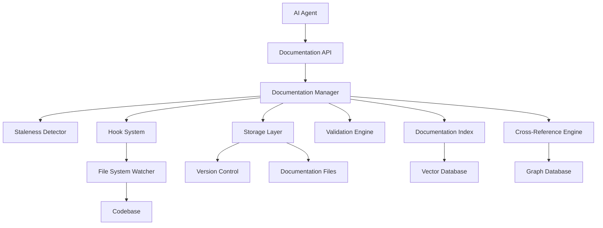
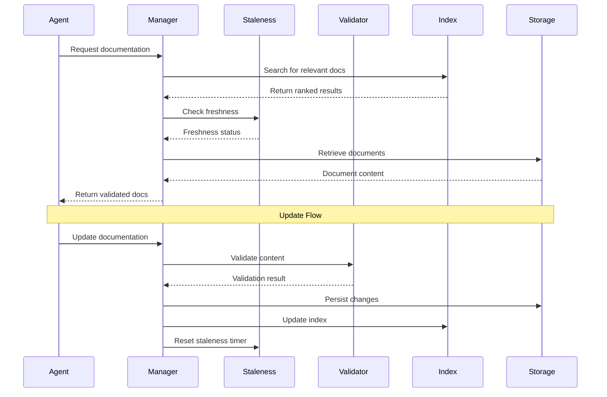

# Design Document: Documentation Management System

## Overview

The Documentation Management System is an automated framework that enables AI agents to maintain, validate, and efficiently access project documentation. The system reduces token consumption by providing agents with up-to-date, well-organized documentation instead of requiring repeated codebase analysis.

The system consists of several interconnected components:
- **Documentation Manager**: Core orchestrator for all documentation operations
- **Staleness Detector**: Identifies and flags outdated documentation
- **Cross-Reference Engine**: Maintains relationships between documentation files
- **Documentation Index**: Provides fast semantic search capabilities
- **Validation Engine**: Ensures documentation accuracy and completeness
- **Hook System**: Triggers documentation updates based on code changes
- **Storage Layer**: Manages documentation persistence and versioning

## Architecture

### High-Level Architecture



### Component Interaction Flow



## Components and Interfaces

### 1. Documentation Manager

The central orchestrator that coordinates all documentation operations.

**Interface:**
```python
class DocumentationManager:
    def create_documentation(
        self,
        file_path: str,
        content: str,
        metadata: DocumentMetadata
    ) -> DocumentID
    
    def update_documentation(
        self,
        doc_id: DocumentID,
        content: str,
        reason: str
    ) -> UpdateResult
    
    def get_documentation(
        self,
        query: SearchQuery,
        context: AgentContext
    ) -> List[Document]
    
    def delete_documentation(
        self,
        doc_id: DocumentID,
        reason: str
    ) -> DeleteResult
    
    def validate_documentation(
        self,
        doc_id: DocumentID
    ) -> ValidationReport
```

**Responsibilities:**
- Coordinate documentation lifecycle operations
- Enforce validation rules before persisting changes
- Trigger cross-reference updates
- Manage documentation versioning
- Provide unified API for agents

### 2. Staleness Detector

Identifies outdated documentation by analyzing code references and update timestamps.

**Interface:**
```python
class StalenessDetector:
    def check_staleness(
        self,
        doc_id: DocumentID
    ) -> StalenessReport
    
    def scan_all_documentation(self) -> List[StaleDocument]
    
    def verify_code_references(
        self,
        doc_id: DocumentID
    ) -> List[BrokenReference]
    
    def mark_as_stale(
        self,
        doc_id: DocumentID,
        reason: StalenessReason
    ) -> None
    
    def refresh_timestamp(
        self,
        doc_id: DocumentID
    ) -> None
```

**Detection Strategies:**
- **Reference Validation**: Parse documentation for code references (file paths, function names, class names) and verify they exist in the codebase
- **Timestamp Analysis**: Flag documents not updated within configurable time threshold
- **Dependency Tracking**: Monitor files referenced by documentation and flag when they change significantly
- **Usage Tracking**: Identify documents rarely accessed by agents

### 3. Cross-Reference Engine

Maintains a graph of relationships between documentation files.

**Interface:**
```python
class CrossReferenceEngine:
    def create_reference(
        self,
        source_doc: DocumentID,
        target_doc: DocumentID,
        reference_type: ReferenceType
    ) -> ReferenceID
    
    def find_related_documents(
        self,
        doc_id: DocumentID,
        max_depth: int = 2
    ) -> List[RelatedDocument]
    
    def update_references(
        self,
        doc_id: DocumentID
    ) -> UpdateResult
    
    def remove_references(
        self,
        doc_id: DocumentID
    ) -> None
    
    def get_reference_graph(
        self,
        root_doc: DocumentID
    ) -> DocumentGraph
```

**Reference Types:**
- **Depends-On**: Document A requires understanding Document B
- **Related-To**: Documents cover similar topics
- **Supersedes**: Document A replaces Document B
- **Implements**: Document describes implementation of concept in another document
- **Example-Of**: Document provides example of concept in another document

**Graph Storage:**
Uses a graph database (e.g., Neo4j) to efficiently query relationships and traverse documentation networks.

### 4. Documentation Index

Provides fast semantic search over all documentation.

**Interface:**
```python
class DocumentationIndex:
    def index_document(
        self,
        doc_id: DocumentID,
        content: str,
        metadata: DocumentMetadata
    ) -> None
    
    def search(
        self,
        query: str,
        filters: SearchFilters,
        limit: int = 10
    ) -> List[SearchResult]
    
    def semantic_search(
        self,
        query_embedding: Vector,
        filters: SearchFilters,
        limit: int = 10
    ) -> List[SearchResult]
    
    def remove_from_index(
        self,
        doc_id: DocumentID
    ) -> None
    
    def rebuild_index(self) -> None
```

**Search Capabilities:**
- **Keyword Search**: Traditional text-based search with ranking
- **Semantic Search**: Vector-based search using embeddings to find conceptually similar documents
- **Filtered Search**: Search within specific categories, components, or date ranges
- **Faceted Search**: Group results by component, type, or other metadata

**Implementation:**
Uses a vector database (e.g., Qdrant, which is already in the project stack) for semantic search combined with traditional text indexing.

### 5. Validation Engine

Ensures documentation accuracy and completeness.

**Interface:**
```python
class ValidationEngine:
    def validate(
        self,
        content: str,
        doc_type: DocumentType
    ) -> ValidationReport
    
    def check_code_examples(
        self,
        content: str
    ) -> List[CodeValidationError]
    
    def verify_references(
        self,
        content: str
    ) -> List[ReferenceError]
    
    def check_structure(
        self,
        content: str,
        doc_type: DocumentType
    ) -> List[StructureError]
    
    def add_validation_rule(
        self,
        rule: ValidationRule
    ) -> None
```

**Validation Rules:**
- **Code Example Validation**: Extract code blocks and verify syntax
- **Reference Validation**: Check that file paths, function names, and URLs are valid
- **Structure Validation**: Ensure required sections are present (e.g., Overview, Examples)
- **Completeness Validation**: Check for TODO markers, empty sections, or placeholder text
- **Consistency Validation**: Verify terminology matches glossary and style guide

### 6. Hook System

Automatically triggers documentation updates based on development events.

**Interface:**
```python
class HookSystem:
    def register_hook(
        self,
        event_type: EventType,
        handler: HookHandler
    ) -> HookID
    
    def trigger_hook(
        self,
        event: Event
    ) -> None
    
    def enable_hook(
        self,
        hook_id: HookID
    ) -> None
    
    def disable_hook(
        self,
        hook_id: HookID
    ) -> None
```

**Hook Types:**
- **File Created**: Generate initial documentation for new files
- **File Modified**: Update related documentation
- **File Deleted**: Remove or archive related documentation
- **Pull Request Created**: Validate documentation completeness
- **Feature Completed**: Ensure all feature documentation is up-to-date
- **Scheduled**: Periodic staleness scans

**Integration:**
Integrates with file system watchers and version control hooks (e.g., Git hooks) to detect events.

### 7. Storage Layer

Manages documentation persistence and versioning.

**Interface:**
```python
class StorageLayer:
    def save_document(
        self,
        doc_id: DocumentID,
        content: str,
        metadata: DocumentMetadata
    ) -> Version
    
    def load_document(
        self,
        doc_id: DocumentID,
        version: Optional[Version] = None
    ) -> Document
    
    def get_versions(
        self,
        doc_id: DocumentID
    ) -> List[Version]
    
    def delete_document(
        self,
        doc_id: DocumentID
    ) -> None
    
    def archive_document(
        self,
        doc_id: DocumentID
    ) -> None
```

**Storage Strategy:**
- **Primary Storage**: Markdown files in `!DOC/` directory
- **Version Control**: Git for version history
- **Metadata Storage**: SQLite or PostgreSQL for document metadata, timestamps, and relationships
- **Vector Storage**: Qdrant for semantic search embeddings
- **Graph Storage**: Neo4j for cross-reference relationships

## Data Models

### Document

```python
@dataclass
class Document:
    id: DocumentID
    title: str
    content: str
    file_path: Path
    doc_type: DocumentType
    metadata: DocumentMetadata
    created_at: datetime
    updated_at: datetime
    version: Version
    language: str = "en"
```

### DocumentMetadata

```python
@dataclass
class DocumentMetadata:
    component: str  # e.g., "backend", "frontend", "ai-services"
    tags: List[str]
    author: str  # Agent or human identifier
    related_files: List[Path]
    coverage_score: float  # 0.0 to 1.0
    staleness_score: float  # 0.0 (fresh) to 1.0 (very stale)
    validation_status: ValidationStatus
```

### SearchQuery

```python
@dataclass
class SearchQuery:
    text: str
    filters: SearchFilters
    semantic: bool = True
    include_cross_refs: bool = True
    max_results: int = 10
```

### SearchFilters

```python
@dataclass
class SearchFilters:
    components: Optional[List[str]] = None
    doc_types: Optional[List[DocumentType]] = None
    tags: Optional[List[str]] = None
    date_range: Optional[DateRange] = None
    min_coverage: Optional[float] = None
    exclude_stale: bool = True
```

### ValidationReport

```python
@dataclass
class ValidationReport:
    is_valid: bool
    errors: List[ValidationError]
    warnings: List[ValidationWarning]
    suggestions: List[str]
```

### StalenessReport

```python
@dataclass
class StalenessReport:
    doc_id: DocumentID
    is_stale: bool
    staleness_score: float
    reasons: List[StalenessReason]
    broken_references: List[BrokenReference]
    last_updated: datetime
    last_accessed: datetime
```

## Correctness Properties

*A property is a characteristic or behavior that should hold true across all valid executions of a system—essentially, a formal statement about what the system should do. Properties serve as the bridge between human-readable specifications and machine-verifiable correctness guarantees.*


### Property 1: Documentation-Code Relationship Discovery

*For any* code file modification, the system should correctly identify all documentation files that reference or relate to that code file.

**Validates: Requirements 1.1**

### Property 2: Update Decision Accuracy

*For any* documentation file and code change, the system should correctly determine whether the documentation needs updating based on whether the change affects documented behavior.

**Validates: Requirements 1.2**

### Property 3: Batch Update Consolidation

*For any* set of multiple file changes in a single commit, the system should process all related documentation updates as a single batch operation rather than multiple individual operations.

**Validates: Requirements 1.5**

### Property 4: Reference Validation Completeness

*For any* documentation file containing code references (file paths, function names, class names), the system should correctly identify which references are valid (exist in codebase) and which are broken.

**Validates: Requirements 2.1, 5.3**

### Property 5: Staleness Marking on Broken References

*For any* documentation file with broken code references, the system should mark it as stale with appropriate reasons.

**Validates: Requirements 2.2**

### Property 6: Time-Based Staleness Detection

*For any* documentation file not updated within the configured time threshold, the system should flag it for review.

**Validates: Requirements 2.3**

### Property 7: Dead Documentation Removal

*For any* documentation confirmed as dead, the system should either remove it from active storage or archive it appropriately.

**Validates: Requirements 2.4**

### Property 8: Cross-Reference Cleanup on Deletion

*For any* documentation file that is deleted, all cross-references pointing to it from other documents should be removed or updated.

**Validates: Requirements 2.5, 3.3**

### Property 9: Related Documentation Discovery

*For any* documentation file being created or updated, the system should identify other documentation files that are semantically related or explicitly referenced.

**Validates: Requirements 3.1**

### Property 10: Bidirectional Cross-Reference Creation

*For any* two related documentation files A and B, if A references B, then B should also reference A (bidirectional linking).

**Validates: Requirements 3.2**

### Property 11: Documentation Graph Consistency

*For any* sequence of documentation operations (create, update, delete), the documentation relationship graph should remain consistent with the actual documentation state.

**Validates: Requirements 3.4**

### Property 12: Cross-Reference Inclusion in Queries

*For any* documentation query, the results should include not only matching documents but also their relevant cross-references.

**Validates: Requirements 3.5**

### Property 13: Index Completeness and Synchronization

*For any* point in time, the documentation index should contain exactly the set of valid (non-deleted) documentation files in storage, with no missing or extra entries.

**Validates: Requirements 4.1, 4.2**

### Property 14: Semantic Search Consistency

*For any* two semantically similar queries (different wording, same meaning), the search results should have significant overlap in returned documents.

**Validates: Requirements 4.4**

### Property 15: Search Result Completeness

*For any* search query result, each returned document should include its summary and relevant cross-references.

**Validates: Requirements 4.5**

### Property 16: Validation Enforcement

*For any* documentation creation or update operation, validation must execute before the documentation is persisted or indexed.

**Validates: Requirements 5.1**

### Property 17: Code Example Syntax Validation

*For any* documentation containing code examples, the system should correctly identify which examples are syntactically valid and which contain errors.

**Validates: Requirements 5.2**

### Property 18: Validation Error Reporting

*For any* documentation that fails validation, the system should produce specific error messages describing each validation failure.

**Validates: Requirements 5.4**

### Property 19: Invalid Documentation Exclusion

*For any* documentation that fails validation, it should not appear in search results or the documentation index until validation passes.

**Validates: Requirements 5.5**

### Property 20: Structural Consistency Enforcement

*For any* documentation file, it should conform to the required structure template (e.g., has required sections in correct order).

**Validates: Requirements 6.1**

### Property 21: Summary Presence Requirement

*For any* documentation file, it should contain a concise summary at the beginning of the document.

**Validates: Requirements 6.2**

### Property 22: Hierarchical Organization Validation

*For any* documentation file, its content should be organized with proper heading hierarchy (no skipped levels, clear nesting).

**Validates: Requirements 6.3**

### Property 23: Progressive Detail Response Format

*For any* documentation query response, it should provide information at multiple detail levels (summary, overview, detailed content).

**Validates: Requirements 6.5**

### Property 24: Coverage Calculation Accuracy

*For any* component in the codebase, the calculated documentation coverage metric should accurately reflect the proportion of code modules that have associated documentation.

**Validates: Requirements 7.1, 7.2, 7.5**

### Property 25: Coverage Threshold Warnings

*For any* component whose documentation coverage falls below the configured threshold, the system should generate a warning.

**Validates: Requirements 7.3**

### Property 26: High-Complexity Gap Identification

*For any* code module with high complexity (above threshold) that lacks documentation, the system should flag it in gap reports.

**Validates: Requirements 7.4**

### Property 27: Event-Hook Triggering Correctness

*For any* configured development event (file created, file deleted, PR created, feature completed), the appropriate documentation hooks should trigger.

**Validates: Requirements 8.1, 8.2, 8.3, 8.4**

### Property 28: Hook Configuration Enforcement

*For any* hook that is disabled in configuration, it should not trigger regardless of events; for any enabled hook, it should trigger on appropriate events.

**Validates: Requirements 8.5**

### Property 29: Version History Preservation

*For any* documentation update, the previous version should be preserved in version history and remain accessible.

**Validates: Requirements 9.1, 9.2**

### Property 30: Historical Query Accuracy

*For any* documentation query with a specific timestamp, the returned content should match the documentation state as it existed at that timestamp.

**Validates: Requirements 9.3**

### Property 31: Change Attribution Tracking

*For any* documentation change, the system should record who or what (agent/human) made the change.

**Validates: Requirements 9.4**

### Property 32: Coordinated Reversion Offering

*For any* code reversion operation, the system should identify related documentation changes and offer to revert them as well.

**Validates: Requirements 9.5**

### Property 33: Multi-Language Storage Support

*For any* documentation content in any supported language, the system should store it correctly with appropriate language metadata.

**Validates: Requirements 10.1**

### Property 34: Language Preference Respect

*For any* documentation query with a language preference, if documentation exists in that language, it should be returned; otherwise, the default language version should be returned.

**Validates: Requirements 10.2, 10.3**

### Property 35: Cross-Language Reference Maintenance

*For any* documentation that exists in multiple languages, cross-references should work correctly across language boundaries.

**Validates: Requirements 10.4**

### Property 36: Translation Staleness Propagation

*For any* documentation update in one language, all other language versions of the same document should be flagged as potentially outdated.

**Validates: Requirements 10.5**

## Error Handling

### Error Categories

**Validation Errors:**
- Invalid documentation structure
- Broken code references
- Syntax errors in code examples
- Missing required sections

**Storage Errors:**
- File system access failures
- Database connection failures
- Version control conflicts

**Search Errors:**
- Index corruption
- Vector database unavailability
- Query parsing failures

**Hook Errors:**
- Event processing failures
- Hook execution timeouts
- Circular dependency detection

### Error Handling Strategies

**Graceful Degradation:**
- If semantic search fails, fall back to keyword search
- If cross-reference generation fails, still save the document
- If validation fails, flag the document but allow manual override

**Retry Logic:**
- Transient storage failures: retry with exponential backoff
- Network failures: retry up to 3 times
- Lock conflicts: retry with jitter

**Error Reporting:**
- All errors logged with context (document ID, operation, timestamp)
- Critical errors trigger alerts
- Validation errors presented to user with actionable suggestions

**Recovery Mechanisms:**
- Index rebuild capability for corrupted indices
- Graph consistency checker and repair tool
- Version history rollback for corrupted documents

## Testing Strategy

### Dual Testing Approach

The system will be validated using both unit tests and property-based tests:

**Unit Tests:**
- Specific examples of documentation operations
- Edge cases (empty documents, malformed content, special characters)
- Error conditions (missing files, invalid references, network failures)
- Integration points between components

**Property-Based Tests:**
- Universal properties that hold across all inputs
- Comprehensive input coverage through randomization
- Validation of correctness properties defined above

### Property-Based Testing Configuration

**Framework:** Use `hypothesis` for Python (already common in Python projects)

**Test Configuration:**
- Minimum 100 iterations per property test
- Each test tagged with feature name and property number
- Tag format: `# Feature: documentation-management-system, Property N: [property text]`

**Example Property Test Structure:**
```python
from hypothesis import given, strategies as st

# Feature: documentation-management-system, Property 4: Reference Validation Completeness
@given(
    doc_content=st.text(),
    code_references=st.lists(st.tuples(st.text(), st.booleans()))
)
def test_reference_validation_completeness(doc_content, code_references):
    """
    For any documentation file containing code references,
    the system should correctly identify which references are valid
    and which are broken.
    """
    # Test implementation
    pass
```

### Test Coverage Goals

- **Unit Test Coverage:** Minimum 80% code coverage
- **Property Test Coverage:** All 36 correctness properties implemented
- **Integration Test Coverage:** All component interactions tested
- **End-to-End Tests:** Complete workflows (create → update → search → delete)

### Testing Priorities

**High Priority:**
1. Reference validation (Properties 4, 5, 17)
2. Cross-reference management (Properties 8, 10, 11)
3. Index synchronization (Property 13)
4. Validation enforcement (Properties 16, 19)

**Medium Priority:**
5. Staleness detection (Properties 6, 7)
6. Search functionality (Properties 14, 15)
7. Version history (Properties 29, 30)
8. Hook system (Properties 27, 28)

**Lower Priority:**
9. Multi-language support (Properties 33-36)
10. Coverage tracking (Properties 24-26)
11. Structural validation (Properties 20-22)

### Continuous Testing

- All property tests run on every commit
- Nightly full test suite including slow integration tests
- Weekly index consistency validation
- Monthly staleness scan of all documentation
